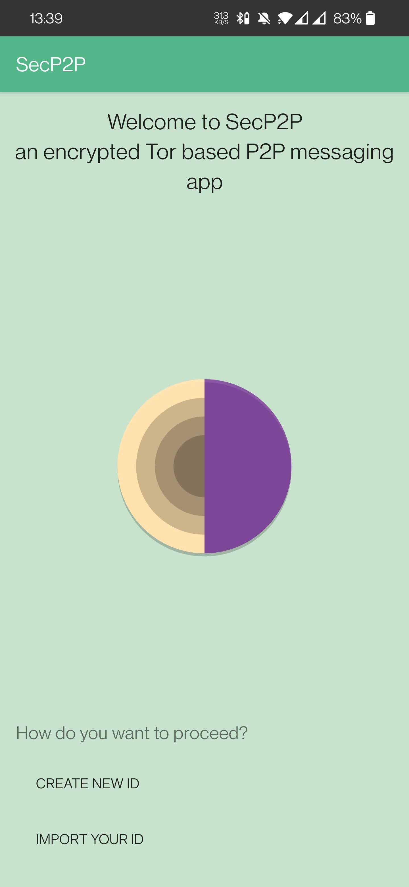
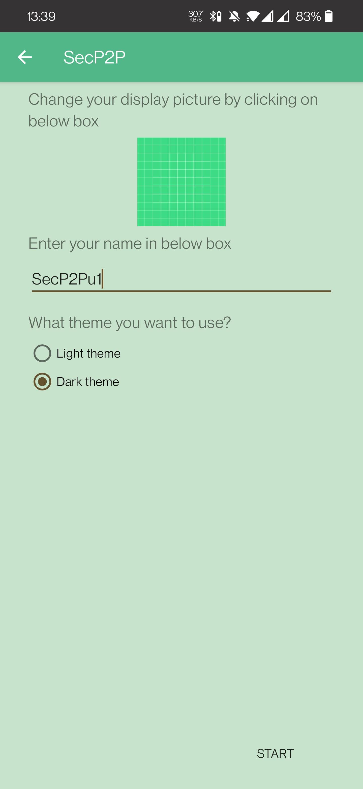
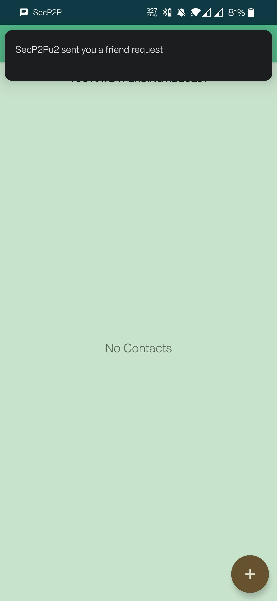
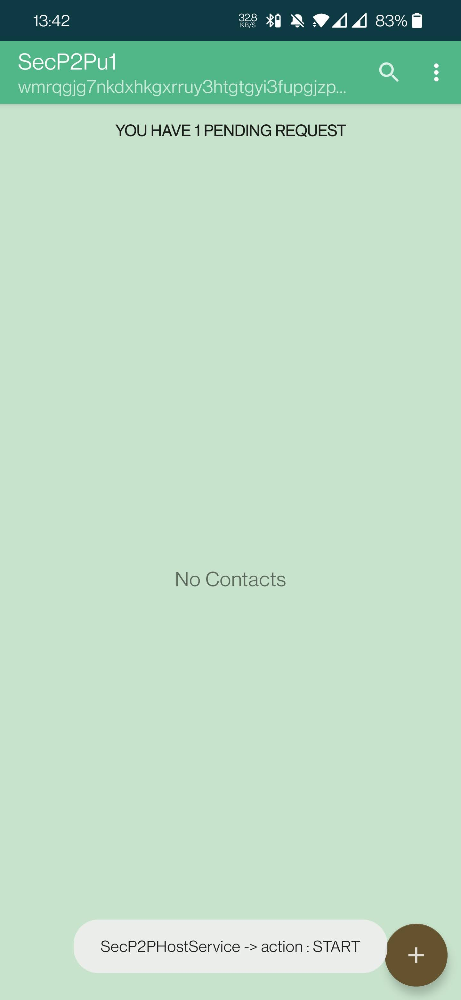
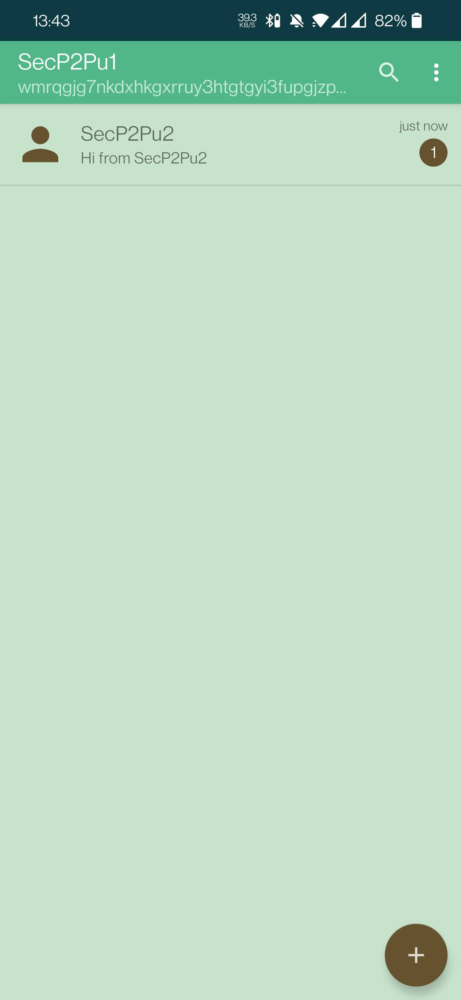
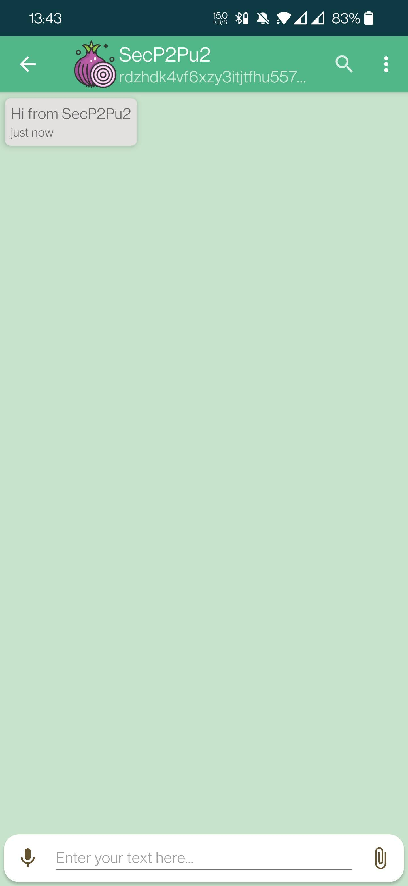

# SecP2P

This is a Tor based peer to peer, encrypted messaging app. The goal of this project is to bring real-time messaging on Tor, enabling users to chat each other with anonymity in mind. This version of the app is on very initial stages however it provides text messaging with media sharing capability.

## Technical Details

This application creates v3 onion hidden service, using 56 char hostname as the ID of the user. It does not include server for managing all the messages that are sent, rather than are sent directly to the receiver. There is no online or typing status for the app (but might be added in the coming releases), but it does indicate that message has been delivered to the user. Moreover, sharing media over SecP2P is slow as compared to other messaging application, because everything runs over Tor network. Sharing large files is also possible, but you have to rely on the network speed of Tor nodes and your connection.

## Features

* Encrypted messaging
* HTTPS based, password oriented file sharing over Tor
* Dark Mode
* Friend request prior chatting
* Incoming message notification
* Save media to external storage
* Share media from other applications
* Display shared/received media
* Swipe reply to a specific message
* Media message tag
* Encrypted ID backup and restore from external storage

## Getting Started

This application works with Tor binary from [https://github.com/05nelsonm/TOPL-Android-TorBinary](https://github.com/05nelsonm/TOPL-Android-TorBinary). If you want to build it yourself, you need ```Android Studio``` for compilation. You need to install one ```BKS``` keystore into i.e: ``` resources\secP2PCert.jks ``` having name ```secP2PCert.jks```, necessary for running https server for sharing media with password access.

### Prerequisites

This source code is ready to build and use, however if you want to add some more features you can clone and add your features, requesting a pull request after. This is initial code base, it might contain bugs. It comes with default  ```Tor 0.4.6.5``` binary, also recommended to not downgrade since v2 hidden service was deprecated from 0.4.6 (July 2nd, 2020), and more security features are included within latest releases.

## Built With

Open-source libraries can be found in app.gradle.

## License

This project is licensed under the GPL v3 License - see the [LICENSE.md](https://github.com/miIian0/SecP2P/blob/master/LICENSE) file for details

## Credits

There many open-source libraries used in this application, and icons have been taken from [flaticon](http://www.flaticon.com/).

## Acknowledgments

I developed this app because I couldn't find any app that was mature enough to provide encrypted messaging over tor with media support. There is one very old application [Chat.onion](https://github.com/onionApps/Chat.onion) that I have improved few ideas.

## Security

Any bugfixes, security audit, code suggestions are very welcome in order to improve and secure SecP2P app.

## Screenshots









